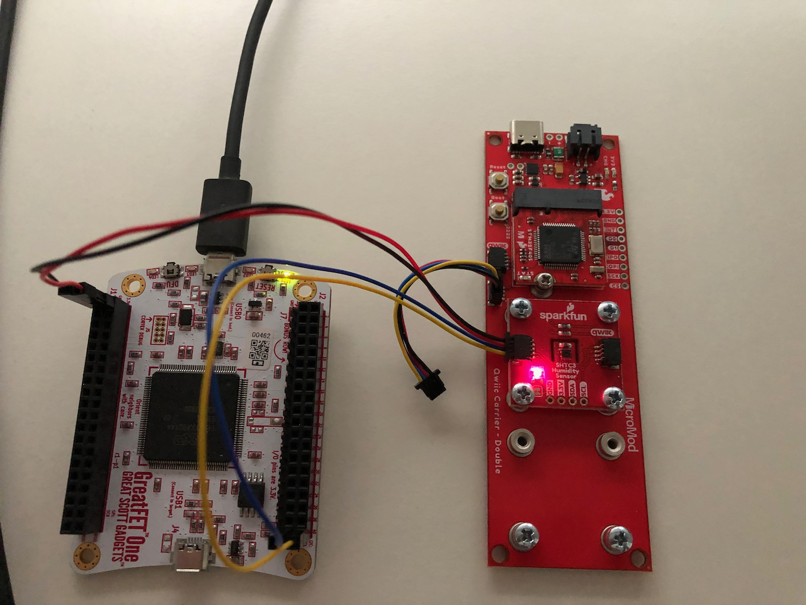

# GreatFET Blinka SHTC3 Example
Example using the GreatFET One and the Adafruit Blinka project to read the SHTC3 temp/humidity sensor.

## Setup the software

Install libusb:

```sh
brew install libusb
```

Install python depencencies:

```sh
pip install -U pip wheel greatfet adafruit-blinka adafruit-circuitpython-busdevice adafruit-circuitpython-shtc3
```

Make sure the GreatFET One firmware is up to date:

```
greatfet fw --auto
```

Check GreatFET One firmware version info:

```
❯ greatfet info
Found a GreatFET One!
  Board ID: 0
  Firmware version: v2021.2.1
  Part ID: a0000a30694f68
  Serial number: 000057cc67e634bc7857
```

Set GreatFET One as the blinka interface adapter:

```sh
export BLINKA_GREATFET=1
```


## Connect the hardware

The following hardware is required:

- [GreatFET One](https://www.sparkfun.com/products/16267)
- [SparkFun Humidity Sensor Breakout - SHTC3 (Qwiic)](https://www.sparkfun.com/products/16467)
- [Flexible Qwiic Cable - Breadboard Jumper (4-pin)](https://www.sparkfun.com/products/17912)

Qwiic cable hookup guide:

| Qwiic Connect Wire Color | Signal Name | GreatFET One Pin |
| ------------------------ | ----------- | ---------------- |
| Black                    | GND         | J1_P1            |
| Red                      | 3.3V        | J1_P2            |
| Blue                     | SDA         | J2_P39           |
| Yellow                   | SCL         | J2_P40           |





## Run the example

```sh
python3 shtc3_simpletest.py
```
